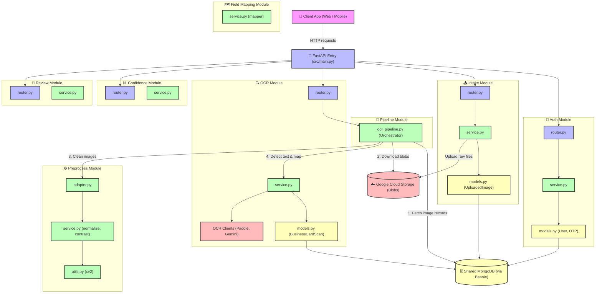

# 🚀 Aura Notes API

A FastAPI backend with MongoDB, Google Cloud Storage, and Gemini AI integration.

## 🏗️ Architecture Diagram



## 📁 Project Structure


```text
fastapi-project
├── alembic/            # Database migrations management (SQL only, Mongo does not need)
├── src/
│   ├── auth/           # Authentication Domain
│   │   ├── router.py, schemas.py, models.py, dependencies.py, config.py, 
│   │   └── constants.py, exceptions.py, service.py, utils.py
│   ├── gcp/            # Google Cloud Platform Domain
│   ├── posts/          # Posts Domain
│   │   ├── router.py, schemas.py, models.py, dependencies.py, constants.py,
│   │   └── exceptions.py, service.py, utils.py
│   ├── main.py         # Application entry point & initialization
│   ├── config.py       # Global configuration settings
│   ├── database.py     # Database connection & session management
│   ├── models.py       # Global/Shared base models
│   ├── exceptions.py   # Global exception handlers
│   └── pagination.py   # Global pagination utility module
├── tests/              # Test suite (organized by domain)
│   ├── auth/
│   ├── gcp/            # Formerly AWS, now using GCP
│   └── posts/
├── templates/          # Frontend templates (not use)
│   └── index.html
```
├── requirements/       # Dependency management
│   ├── base.txt, dev.txt, prod.txt
├── .env                # Environment variables
├── .gitignore          # Git ignore file
├── logging.ini         # Logging configuration
└── alembic.ini         # Alembic migration configuration
```
Getting Started
### 1. Install Dependencies
Choose the appropriate requirements file for your environment:

```bash
pip install -r requirements/dev.txt
```
### 2. Run the Application
Start the development server using Uvicorn:

```bash
uvicorn src.main:app --reload
```
### 3. API Documentation
Once the server is running, you can access the interactive Swagger UI at:
[http://127.0.0.1:8000/docs](http://127.0.0.1:8000/docs)
